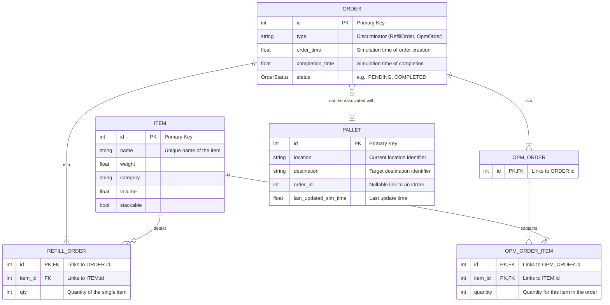

# Database Schema

```mermaid
erDiagram
    ITEM {
        int id PK "Primary Key"
        string name "Unique name of the item"
        float weight
        string category
        float volume
        bool stackable
    }

    ORDER {
        int id PK "Primary Key"
        string type "Discriminator (RefillOrder, OpmOrder)"
        float order_time "Simulation time of order creation"
        float completion_time "Simulation time of completion"
        OrderStatus status "e.g., PENDING, COMPLETED"
    }

    REFILL_ORDER {
        int id PK,FK "Links to ORDER.id"
        int item_id FK "Links to ITEM.id"
        int qty "Quantity of the single item"
    }

    OPM_ORDER {
        int id PK,FK "Links to ORDER.id"
    }

    OPM_ORDER_ITEM {
        int id PK,FK "Links to OPM_ORDER.id"
        int item_id PK,FK "Links to ITEM.id"
        int quantity "Quantity for this item in the order"
    }

    PALLET {
        int id PK "Primary Key"
        string location "Current location identifier"
        string destination "Target destination identifier"
        int order_id "Nullable link to an Order"
        float last_updated_sim_time "Last update time"
    }

    %% --- Relationships ---

    %% Inheritance (One-to-One from Order)
    ORDER ||--|{ REFILL_ORDER : "is a"
    ORDER ||--|{ OPM_ORDER : "is a"

    %% RefillOrder is for one specific Item (Many-to-One)
    ITEM ||--o{ REFILL_ORDER : "details"

    %% OpmOrder has many Items via the linking table (Many-to-Many)
    OPM_ORDER ||--|{ OPM_ORDER_ITEM : "contains"
    ITEM ||--|{ OPM_ORDER_ITEM : "is part of"

    %% A Pallet can be associated with an Order (optional, Many-to-One)
    ORDER }o..o| PALLET : "can be associated with"
``` 
