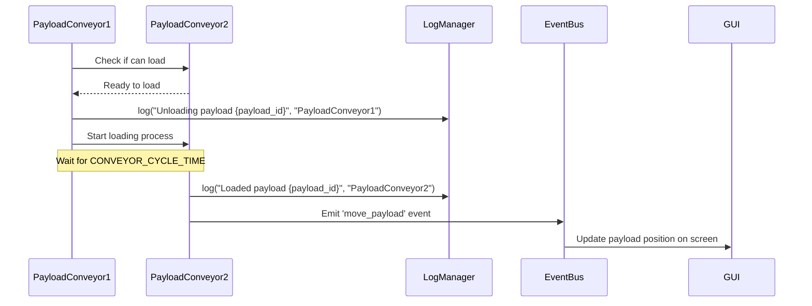
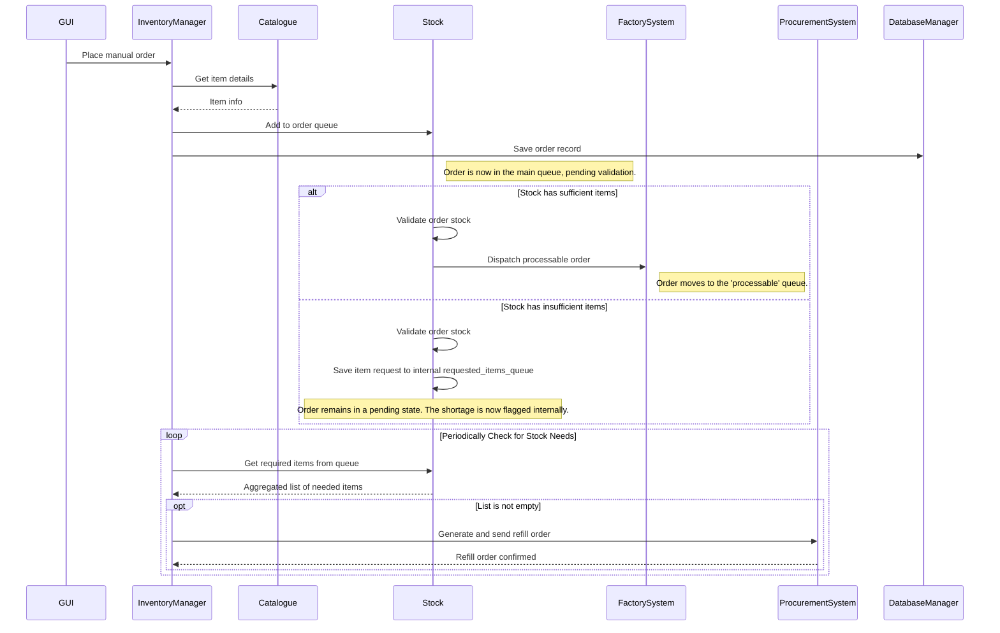

# Simulation Flow

### Payload Movement

Each component registers a Simpy process. When a process is completed, component emits an event through Event Bus for GUI updating.
Sequence example for moving a payload through conveyors:

### Placing orders in GUI

The user may place manual orders through an order dialog. An Order-object is created in InventoryManager, placed in order queue in the stock requested, and stored in database.
The stock requested may also place internal Refill orders if needed. Sequence example for placing an order:

  
